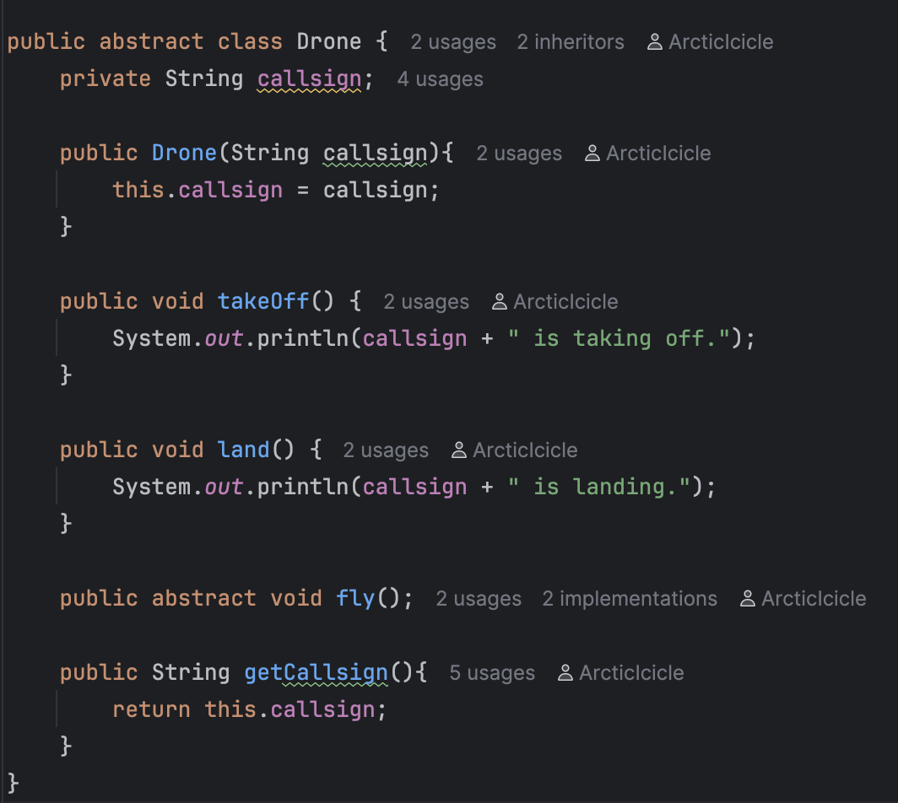
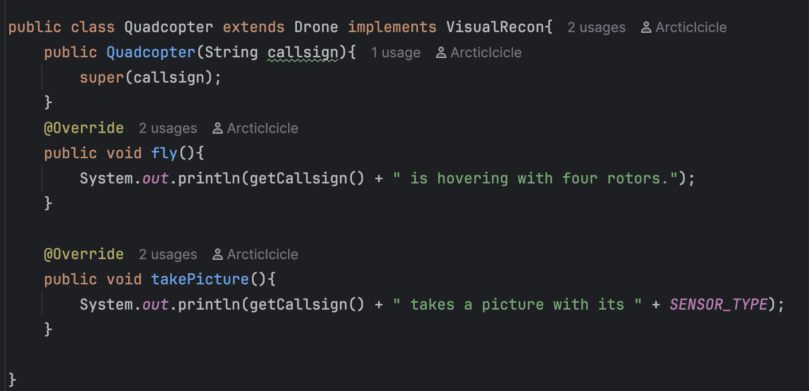
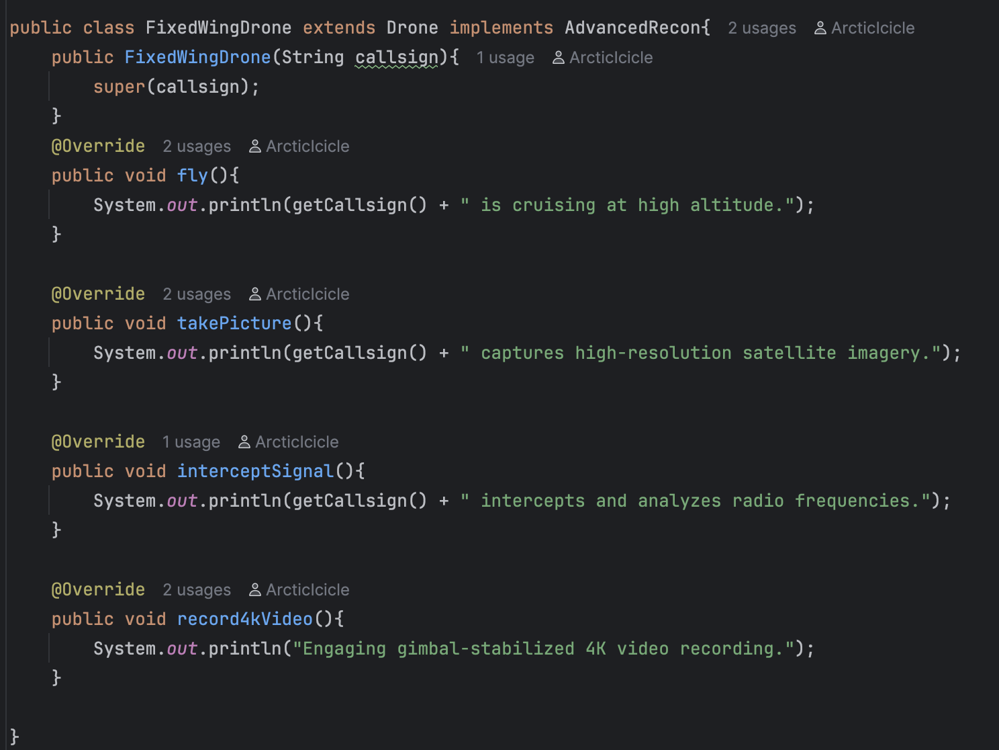
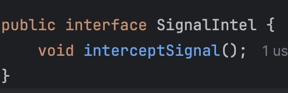
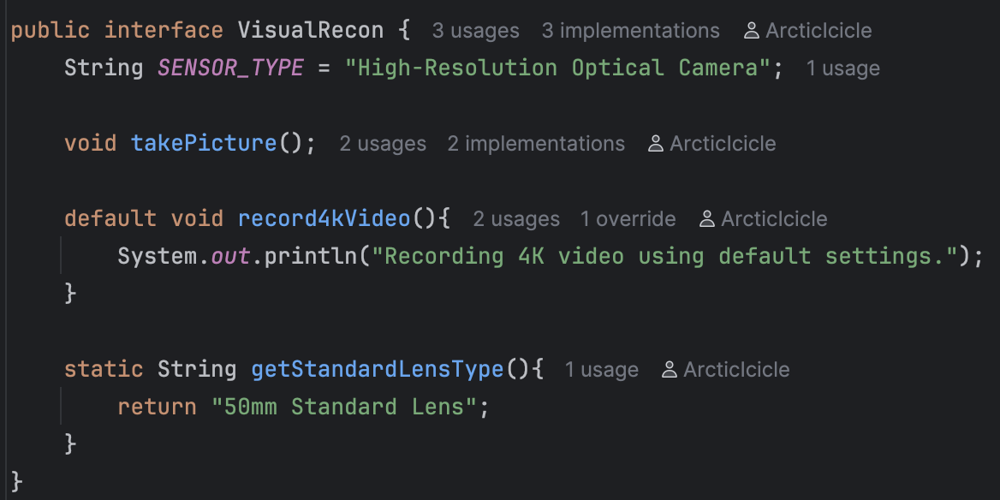
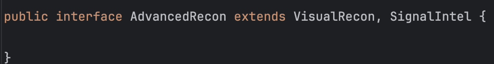
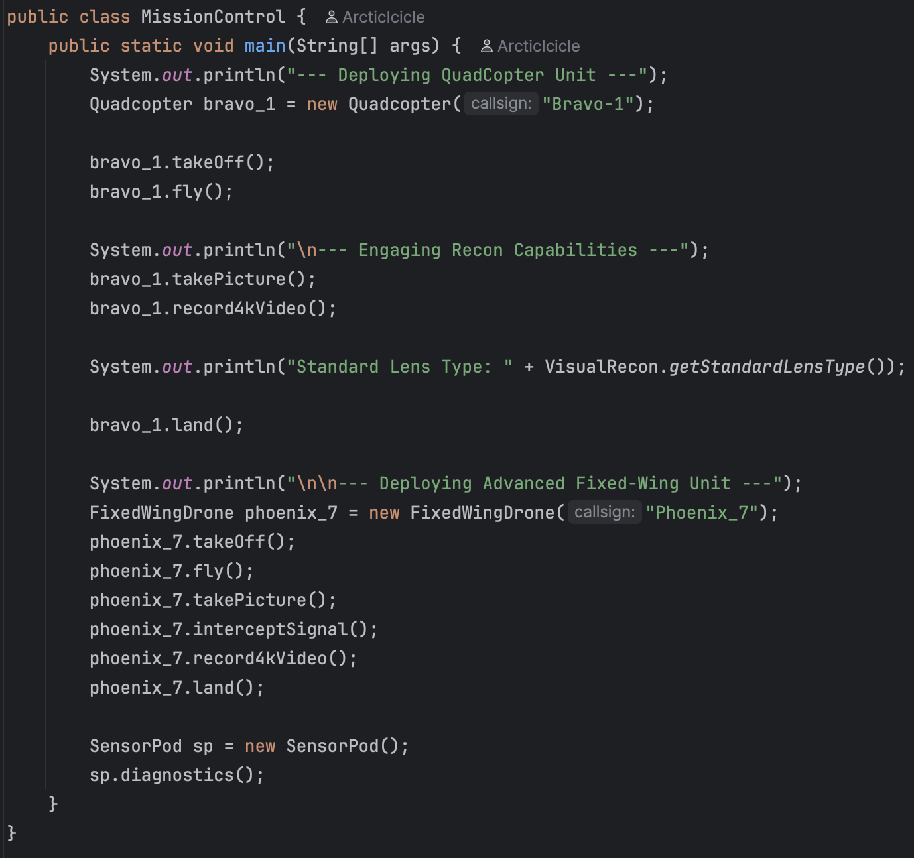
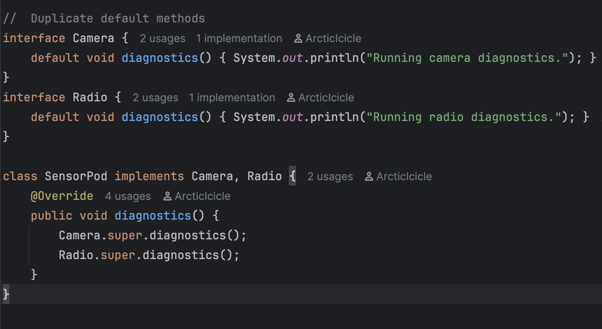

# Java Inheritance and Interfaces

Submitted by: Christian Choa  
Date: August 13, 2025

## Output

## Classes
### Drone

### Quadcopter

### Fixed Wing Drone

## Interfaces
### Signal Intel

### Visual Recon

### Advanced Recon

## Mission Control

